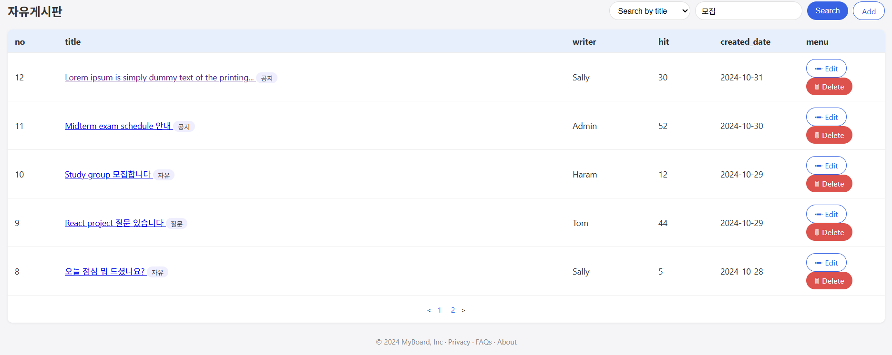
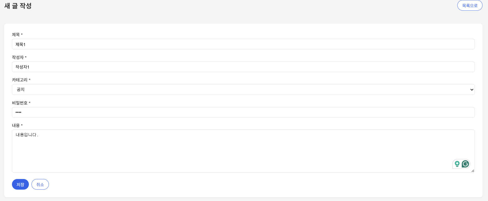
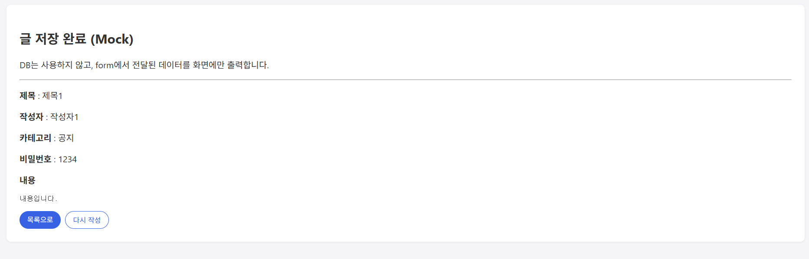
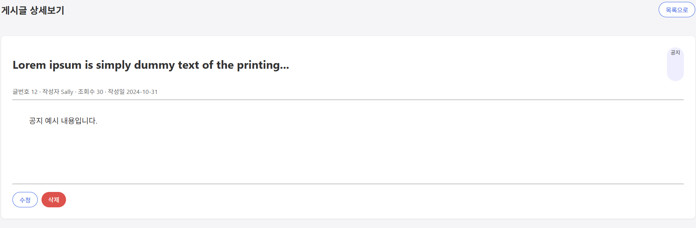
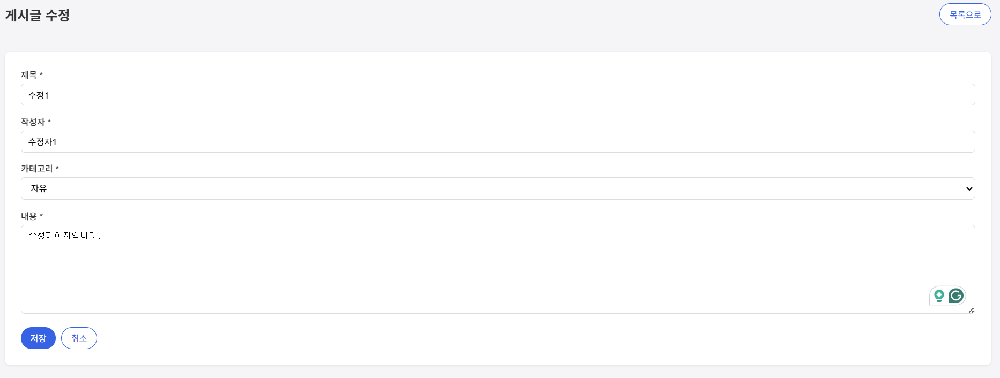
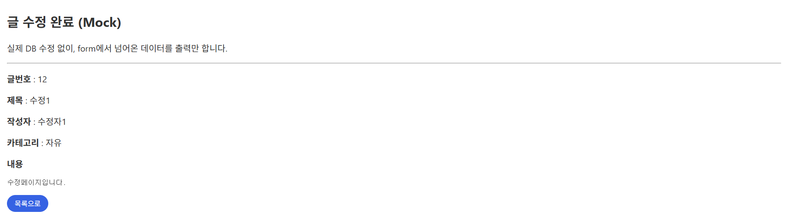
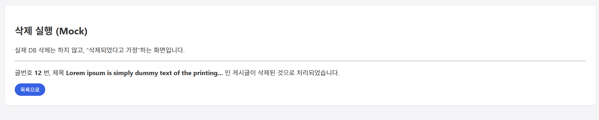

# JSP 게시판 프로젝트 (11주차 과제)

---

## 📌 1. 목록 보기 (list.jsp)
게시판의 글 목록을 출력하는 페이지입니다.

---

## 📌 2. 글쓰기 페이지 (write.jsp)
사용자가 제목과 내용을 입력하는 화면입니다.

---

## 📌 3. 글 저장 페이지 (write_ok.jsp)
글쓰기에서 입력된 데이터를 처리하고 목록으로 이동합니다.

---

## 📌 4. 상세보기 페이지 (view.jsp)
선택한 글의 내용을 상세하게 보여주는 화면입니다.

---

## 📌 5. 수정 페이지 (edit.jsp)
기존 글의 내용을 수정할 수 있도록 폼이 구성된 페이지입니다.

---

## 📌 6. 수정 실행 페이지 (edit_ok.jsp)
수정된 내용을 처리하고 목록으로 이동합니다.

---

## 📌 7. 삭제 실행 페이지 (delete_ok.jsp)
선택한 글을 삭제하고 목록으로 이동하는 처리 페이지입니다.

---

